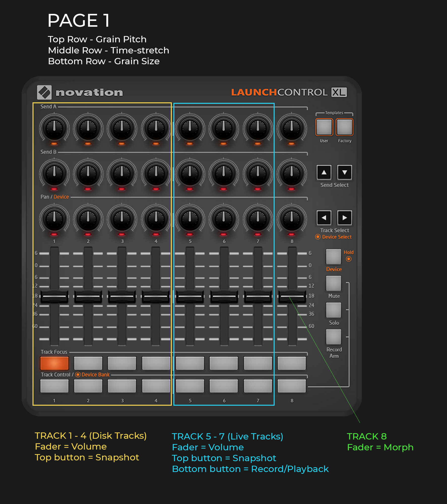
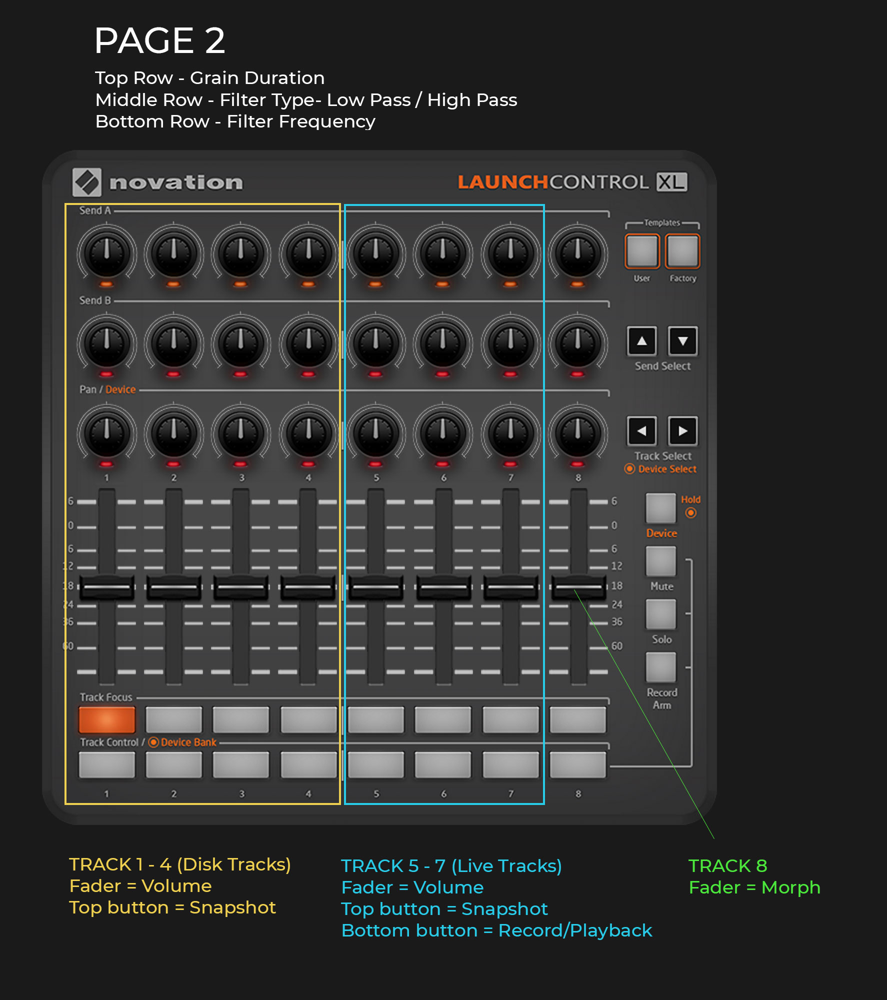
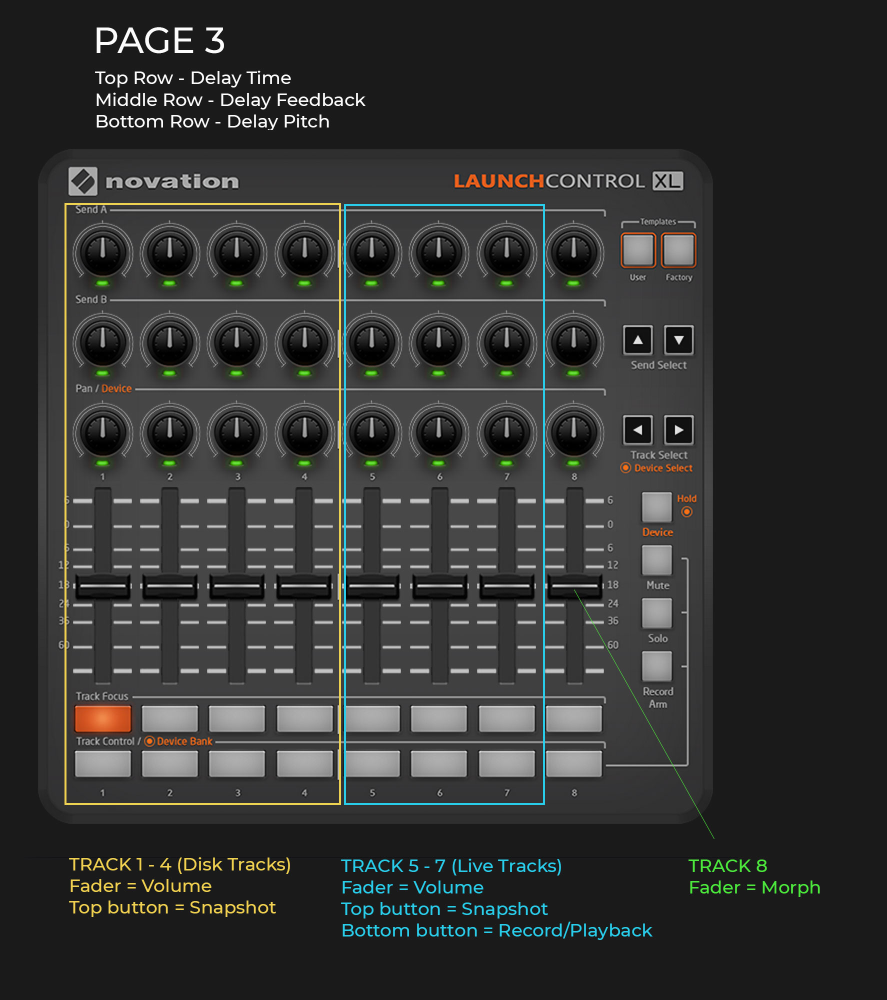
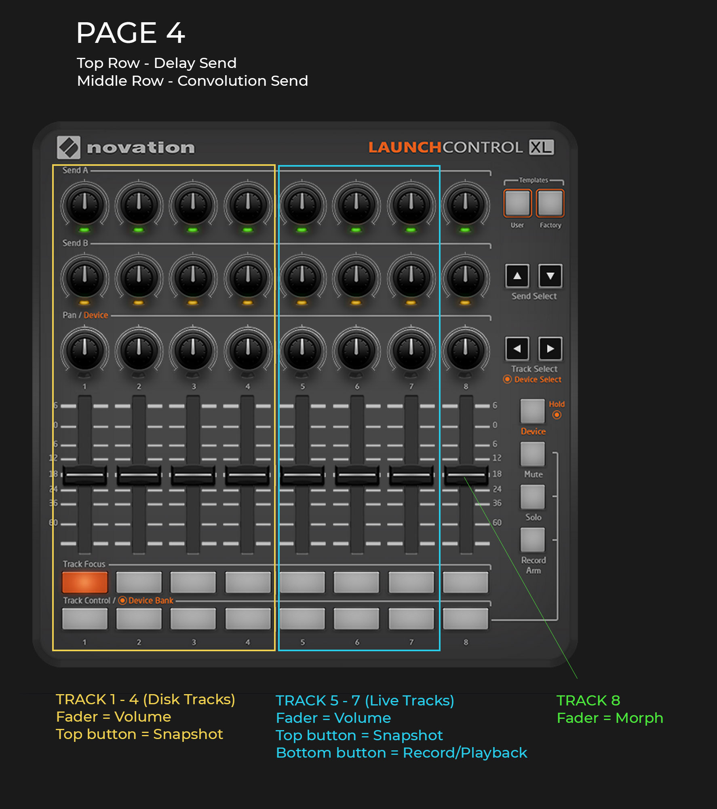
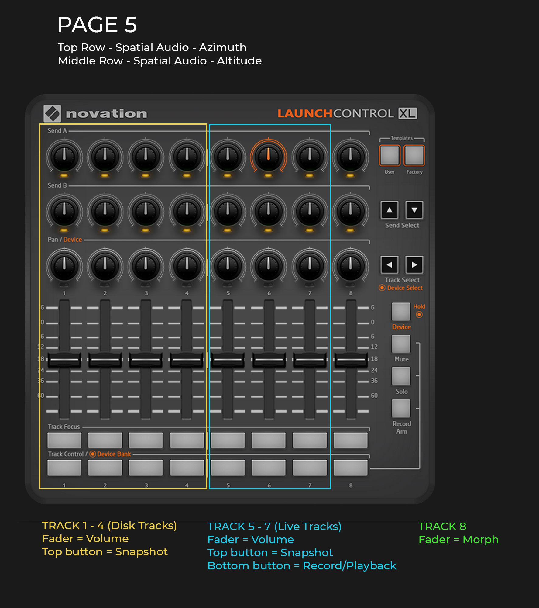
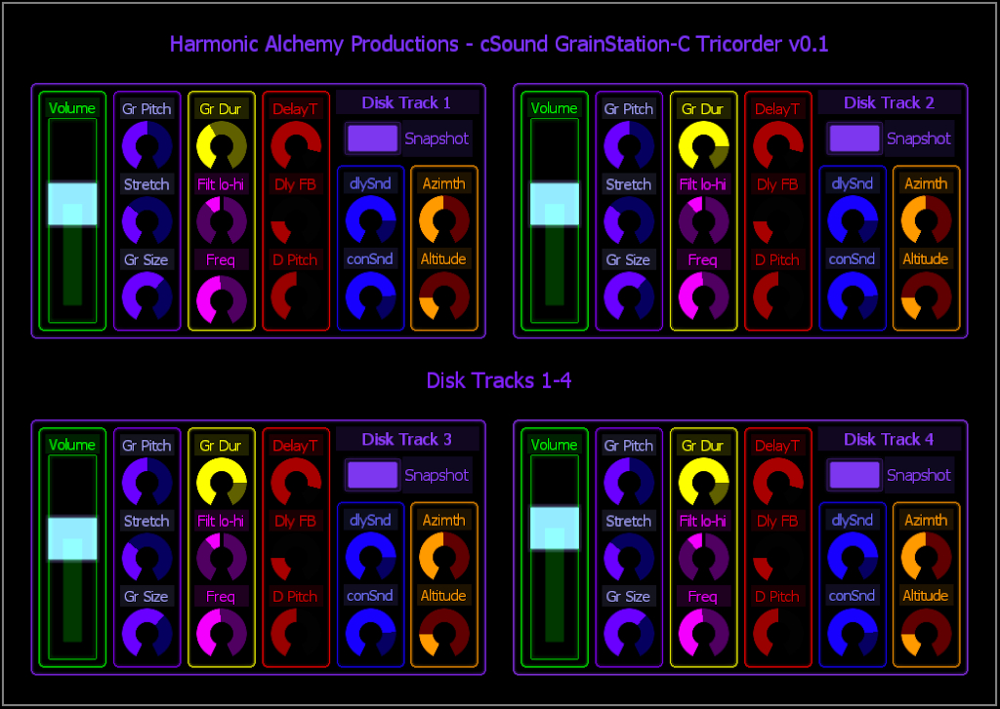
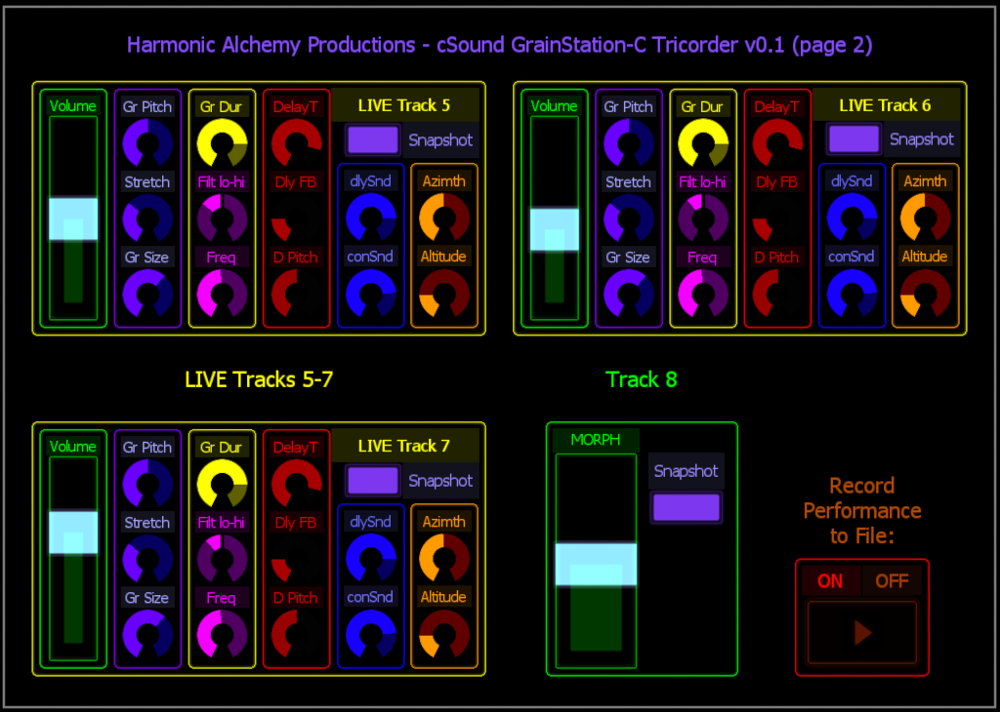

# Grainstation-C (tricorder fork)

**by Harmonic Alchemy Productions**

**_(for HAP Virtual Tricorder - Lemur & Open Stage Control interfaces)_**

Written by Alisha Awen under GPLv3

Adapted from: 

**Grainstation-C**

Written by Micah Frank under GPLv3

<http://micahfrank.com>

<http://micahfrank.bandcamp.com>

**_Grainstation-C is an open-source, granular performance workstation designed to build realtime, evolving sound sculptures with optional ambisonics. It seamlessly integrates with a Novation LaunchControl XL Mark 2 (and is easily modifiable for any other controller, e.g., This fork)... Grainstation-C can process 4 disk tracks and 3 live input streams to create rich intertwining/evolving microsonic textures. And this is just the beginning folks!_** :octocat:

## Introduction:

This fork includes the ability to control the workstation via **Lemur _(running on iPad, iPhone, or Android device)_ as well as Open Stage Control _(running on any device that can run recent versions of Chrome or Firefox web browsers)_**...  The Open Stage Control server can run on loads of devices as well, including some of your embedded DIY outboard studio devices, Linux, Windows, or Mac... Csound can also run on such devices...

You can **_save any state as a snapshot and morph to that snapshot at any point in a performance_**. It has **_6 independent pitch delay lines, 6 switchable low pass and high pass filters, live audio looping and multiple granular processing controls including granular time-stretching, frame animation and granular pitch shifting_**.

> Grainstation-C was originally inspired by the Make Noise System Concrete but shortly took on many unique characteristics of its own. http://www.makenoisemusic.com/synthesizers/system-concrete

**_Grainstation-C was extensively used on Micah Frank's album:
["Quetico"](https://micahfrank.bandcamp.com/album/quetico) which you
are invited to take a listen to.  This album, as well as other fine
works may be purchased from the same BandCamp link...  "Quetico"
reflects an extensive use of Grainstation-C to process field
recordings and create walls of textures!  Listen to it and be
amazed!!!_**

Watch this [demo video](https://youtu.be/BQ5MSDqFaX8) to see what **Grainstation-C** can do for you!

## Questions:

Please ask any questions in the issues section: https://github.com/chronopolis5k/Grainstation-C/issues

## Controllers:

### Novation Launch Control XL Mark2

Grainstation-C has been developed to integrate with the Novation Launch Control XL Mark2. However, any other controller should work as well. **_(See: HAP Virtual Tricorder heading below for two new controllers offered within this fork)_**.

The MIDI note and controller mapping schema is in the: **[MIDI-Implementation-list.txt](https://github.com/harmonicalchemy/Grainstation-C/blob/develop/MIDI-Implementation-list.txt)** file...

This repository includes 4 template pages for the Novation Launch Control XL. To change pages, press **`[User + Track Control 1-4]`** buttons.

- **Page 1** - Granular Controls - pitch, time-stretch, grain size

- **Page 2** - Granular and Filter Controls - grain duration, filter type (low pass, high pass), filter frequency

- **Page 3** - Pitch Delay Controls - delay time, delay feedback, delay pitch shift

- **Page 4** - Delay and Convolution Controls - delay send amount, convolution send amount

- **Page 5** - Ambisonics / Spatial Audio Controls - azimuth angle, altitude angle

Download the Launch Control XL Mk2 software (for loading the templates): https://bit.ly/2y3rWul

### Recording

You can render a file in real-time to the /renders folder simply by pressing the [Record Arm] button on the Launch Control XL. The button will begin to blink and your performance will be recorded. You can stop and restart recording as needed by pressing the button again.

### Ambisonics

You can enable the ambisonics flag and immediately tweak the azimuth and altitude for any track. When you render the performance, a multichannel B-encoded file will also be rendered to the "b_format" folder.

### Installation

Grainstation requires Csound: http://csound.com/download.html CsoundQT comes with Csound and will enable you to run Grainstation C.

See this video for a quick explanation about installation and setup
https://www.dropbox.com/s/im1vivrjv98isub/Grainstation-C_config.mp4?dl=0

### Page Controls Overview

## HAP Virtual Tricorder Controller

Instead of using the Novation Launch Control XL Mark2, you now have the option of trying Grainstation-C using either Liine Lemur or Open Stage Control running as a virtual instrument controller on iPad, or Android pad... Everything written above for the Novation hardware controller works pretty much the same on these new interfaces...  

### Lemur Tricorder Interface Overview 

All controlls are laid out on two screens rather than four:

**Page 1: _(Disk Tracks 1-4)_**

**Page 2: _(LIVE Tracks 5-7, Morph Track 8, & Record Button)_**

## Open Stage Control:

This interface is still in the making...  Currently my iPad is too old to support the new browsers needed for display... My iPhone works fine however, therefore I am forced to make a multi page interface for that device that shows only one track with all associated controls for it per page... If and when I get a newer iPad (or iPad Pro ;-) I will begin design of an interface for that...  I will start by simply creating the interface on my iMac and tailor a responsive design from that...
